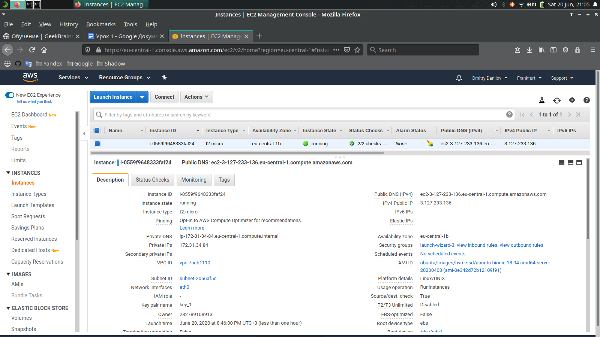

# Урок 1. Linux и облачные вычисления

- Создание и запуск сервера Linux в AWS
- Использование Putty и WinSCP

## Практическое задание

### Задачи

1. Создать аккаунт в Amazon Web Services
2. Создать экземпляр на сайте AWS
3. Подключиться к экземпляру с помощью Putty

Примечание:
сдавать в виде текста из консоли с успешным подключением
и скриншотоа со списком виртуальных машин в AWS

### Решение

2. Launch the AWS instance.


3. Connect to the AWS instance.
```
ubuntu@ip-172-31-34-84:~$ uname -no
ip-172-31-34-84 GNU/Linux
ubuntu@ip-172-31-34-84:~$ uname -srvm
Linux 4.15.0-1065-aws #69-Ubuntu SMP Thu Mar 26 02:17:29 UTC 2020 x86_64
```
