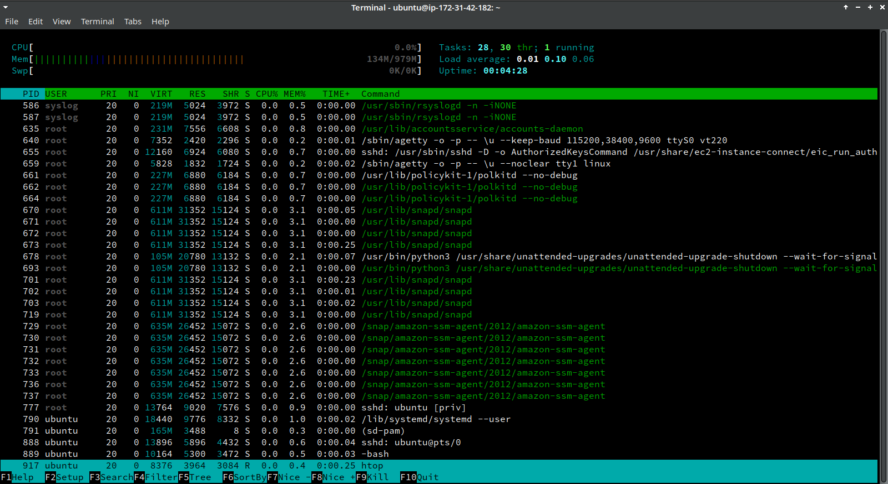
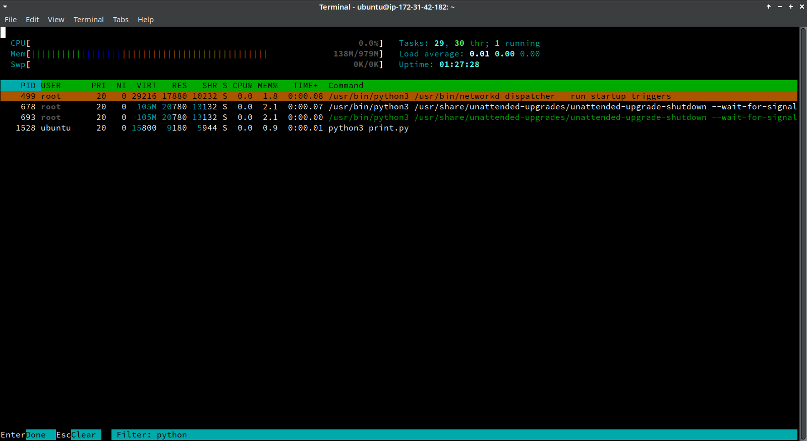

# Урок 5. Мониторинг ресурсов. Архивирование файлов. Поиск данных

- Мониторинг ресурсов
(оперативная память, процессоры и файловая система):
*top* и *htop*, *df* и *du*
- Архивирование и упаковка файлов: *tar* и *zip*
- Текстовый поиск: *find*

## Практическое задание

### Задачи

1. Запустить *htop* и посмотреть,
сколько процессоров и оперативной памяти есть на сервере.

2. Найти все программы с расширением *.py*.

3. Создать и запустить программу на *python*,
выводящую числа от 0 до 100 включительно.
Запустить *htop* во время выполнения прогkраммы
и найти выполняемую программу в списке процессов по ключевому слову *python*,
используя средства поиска *htop*.


### Решение

1. Runs *htop* on AWS instance: 1 CPU and 979M Mem are available.

    ```
    $ htop
    ```

    { width=80% }

2. Finds all files with *.py* extension.

    ```
    $ sudo find / -name '*.py' > find.log

    $ head -5 find.log
    /usr/src/linux-headers-5.4.0-1018-aws/scripts/checkkconfigsymbols.py
    /usr/src/linux-headers-5.4.0-1018-aws/scripts/bpf_helpers_doc.py
    /usr/src/linux-headers-5.4.0-1018-aws/scripts/spdxcheck.py
    /usr/src/linux-headers-5.4.0-1018-aws/scripts/gen_compile_commands.py
    /usr/src/linux-headers-5.4.0-1015-aws/scripts/checkkconfigsymbols.py

    $ tail -5 find.log
    /snap/core18/1754/usr/share/subiquity/subiquitycore/ui/views/network_default_route.py
    /snap/core18/1754/usr/share/subiquity/subiquitycore/user.py
    /snap/core18/1754/usr/share/subiquity/subiquitycore/utils.py
    /snap/core18/1754/usr/share/subiquity/subiquitycore/view.py
    /etc/python3.8/sitecustomize.py

    $ wc --line < find.log
    10854   
    ```

3. Runs *python* proram and finds this process with *htop* filter.

    ```
    $ python3 print.py > print.log 2>&1 &
    [1] 1528
    $ htop
    ```

    { width=80% }

   print.py:

    ```python
    from time import sleep

    delay = 1
    for _ in range(101):
       print(_)
       sleep(delay)

    ```
